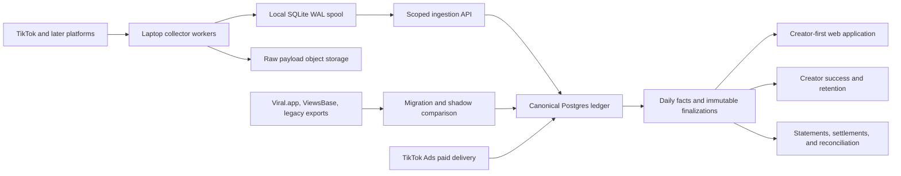

# Creator-First Platform: Owned Video Tracking Foundation

**Status:** Proposed target architecture and migration plan

**Prepared:** 2026-08-28

**Scope:** TikTok-first owned video discovery, metric collection, evidence, and finalization; designed as the foundation for the future creator web application

**Supersedes:** The provider-first and campaign-first tracking direction in the current `PRD.md`

## 1. Decision

Build the future system as a new, creator-first application and data model. Treat the current `tt-ads-manager`, Viral.app integrations, ViewsBase integration, and Michael's shadow collector as migration inputs and comparison sources, not as the future source of truth.

All external video discovery and metric collection will execute from this Linux laptop. The laptop will run the collectors, scheduling, retries, and local durable outbox. It must not be the only copy of the data: accepted observations, provenance, finalizations, and backups will be stored in a canonical Postgres database and object storage so the web app and payment system remain available when the laptop is asleep, rebooting, or disconnected.

The first production slice is:

1. Establish stable creator, account, and video identity.
2. Discover every current and new video for every in-scope account.
3. Record append-only metric observations with explicit source and capture times.
4. Prove whether each collection run was complete, partial, capped, blocked, or failed.
5. Derive versioned daily facts without inventing history.
6. Freeze immutable contract-window results, beginning with the first seven days.
7. Let payments, creator success, onboarding, and retention consume those facts without being able to rewrite them.

The architectural boundary is deliberate: the tracker measures and certifies facts; it never decides a creator's deal and never moves money.

## 2. Why this has to be rebuilt

The current application is not an autonomous tracker. It combines manual imports, live provider calls, page-triggered refreshes, short-lived caches, and sparse snapshots. There is no durable polling worker or scheduled inventory reconciliation.

The historical notes and transcripts repeatedly expose the same failure classes:

- provider endpoints returning only top 100, retained 60/100/300 subsets, or other capped collections;
- at least 25 confirmed videos never tracked in one prior audit;
- provider history disappearing or changing after the fact;
- partial/rate-limited responses looking like complete payable results;
- stale cached responses producing false validation passes;
- no independent proof that all account pages or videos were enumerated;
- handle-based mapping failing after renames or across TikTok and Instagram;
- mutable current counters being used as if they were an accounting ledger;
- the first lifetime counter observation being mistaken for views gained that day;
- unknown paid attribution being treated as zero deduction;
- request-time reporting paths doing work that belongs in durable background jobs.

The most important already-agreed design principles from the August payout redesign are retained here:

- append-only per-video observations;
- caption captured at first discovery;
- immutable day-seven finalization;
- freeze -> draft statement -> creator review -> exceptions -> lock/hash -> pay -> reconcile.

## 3. Verified starting point

### Current production database

Read-only counts captured on 2026-08-28 for the GoTall organization:

| Entity or condition | Current count | Meaning for migration |
|---|---:|---|
| Creators | 106 | 6 `ACTIVE`, 100 `NEW`; lifecycle state is not reliable tracking scope by itself |
| Platform accounts | 109 | 106 TikTok and 3 Instagram |
| Accounts missing stable native account ID | 15 | Must be resolved or quarantined before identity can be trusted |
| Videos | 756 | All currently stored videos are TikTok |
| Videos missing `creatorPlatformAccountId` | 438 | Cannot safely infer ownership from the current video row alone |
| Metric snapshots | 807 | 705 videos have one snapshot; 51 have two |
| Source mappings | 924 | Useful migration evidence, not proof of complete inventory |
| Latest stored snapshot/sync time | 2026-05-03 | The local history is stale and far too sparse for daily reconstruction |

All 756 current video rows have a source video ID and campaign, but their provider provenance is effectively `viral_or_unknown`. Some imported `publishedAt` values may be import time because the legacy single-video flow substituted "now" when the provider did not return publication time. The migration therefore needs a publication-time source and confidence field.

### Michael's collector and enrichment repos

The high-confidence Michael ad-manager repo is `/home/ark296/projects/gotall-viral-dash`; the enrichment companion is `/home/ark296/projects/gotall-viral-enrich`.

Michael's collector proves several useful parts of the design:

- public TikTok account enumeration can recover stable video IDs that Viral.app omitted;
- the first shadow evaluation found 948 videos for three seeded creators and materially more inventory than provider-retained subsets;
- caption and hashtag parity was 100% across 260 time-aligned matches;
- provider counters were commonly 9-34 hours stale, so comparisons must use time-nearest observations;
- age/sensitivity restrictions blocked three posts, so public collection alone cannot guarantee coverage;
- atomic writes, typed outcomes, an append-only intraday table, and a `yt-dlp` -> commercial API fallback are reusable prototypes.

The current local shadow database is newer than the written first-run report: it contains 4 creator rows, 948 videos, 2,506 intraday observations, and 948 daily snapshot rows, with its last observation on 2026-08-06. It remains a local shadow dataset, not payout authority and not current production inventory. Its daily row is mutable within a day and it has no immutable window finalization.

The enrichment repo is valuable later for transcript, OCR, content format, product mention, template clustering, comments, and viewer-intent signals. Enrichment belongs beside the metric ledger, keyed by canonical video ID; it must not block core tracking.

### Source freshness

- `tt-ads-manager` remote references were refreshed on 2026-08-28. Local `main` and `origin/main` both resolve to `742a3fdb8c628b6d473258d3988306f1dae36a16`.
- The Michael repos' private upstream fetches are currently blocked by missing/invalid GitHub authentication. The latest locally cached `gotall-viral-dash` upstream ref is from 2026-08-07 and the enrichment upstream ref is from 2026-08-02.
- The shadow worktree is heavily modified by its GoTall hardening work and must not be blindly pulled, merged, or deployed. Before implementation begins, restore GitHub authentication, fetch, and review the delta without overwriting that worktree.

This plan incorporates the checked-out code, the cached upstream changes, the current local shadow database, the current production schema/data, and the prior transcripts. The unavailable private remote delta is an explicit evidence limitation, not silently assumed to be empty.

## 4. Target architecture

### Execution plane: this laptop

The laptop owns all outbound platform collection:

- account discovery and pagination;
- per-video metric requests;
- authenticated/commercial fallback for explicitly blocked content;
- retries, backoff, rate-limit handling, and resumable cursors;
- local write-ahead spool when the cloud endpoint is unavailable;
- raw response hashing and upload;
- source comparison during migration.

Vercel request handlers do not scrape or poll platforms. They read canonical facts and enqueue explicit work where permitted.

### Durable data plane: Postgres plus object storage

Postgres owns canonical identities, due work, append-only observations, coverage proofs, derived facts, and finalization hashes. Object storage owns immutable raw responses and export manifests. The web app never treats a provider cache as canonical history.

The local SQLite spool is a delivery buffer and diagnostic copy, not the sole authority. A local record is deleted or compacted only after the remote ledger acknowledges its idempotency key and raw payload hash.

### Application plane: creator first

The future web application is organized around the creator and their accounts, not around provider rows or one campaign:

`creator -> platform accounts -> videos -> observations/facts -> eligibility/deals -> statements -> payouts`

A video may participate in multiple campaigns or contracts over time. Campaign membership therefore becomes an effective-dated join, not a mutable `campaignId` on the canonical video.

## 5. Data rules that every table must follow

1. Use application-generated UUIDv7 IDs for locality and globally safe imports.
2. Scope all creator, account, video, and mapping uniqueness by `organization_id`.
3. Store times as `timestamptz` in UTC; retain source timezone/reporting date separately when a provider uses an account-local day.
4. Use `bigint` for cumulative counters and validate counters as non-negative when present.
5. `NULL` means unknown or not supplied. Zero means the source explicitly and completely reported zero. They are never interchangeable.
6. Stable native platform IDs are canonical. Handles and URLs are aliases with history, never primary identity.
7. Observations, raw payload records, completed runs, and finalizations are append-only. Corrections create a new version linked to the prior row.
8. `updated_at` is operational metadata, never evidence of when a platform metric was observed.
9. Every derived value stores the exact observation IDs, algorithm version, completeness state, and provenance used to produce it.
10. No source failure, timeout, truncation, rate limit, or unknown attribution can silently become a complete fact or zero.
11. Composite foreign keys or equivalent database constraints must prove that referenced creator, account, video, campaign, run, and fact rows belong to the same organization; application checks alone are insufficient.

## 6. Proposed tracking schema

This is the minimum payment-grade tracking boundary. Normal creator profile, authentication, team, contract, and payment tables live in adjacent domains.

### 6.1 `creator_platform_accounts`

One canonical platform account owned by one creator within one organization.

| Column | Type | Rules / purpose |
|---|---|---|
| `id` | uuid PK | UUIDv7 |
| `organization_id` | uuid FK | Required tenant boundary |
| `creator_id` | uuid FK | Required creator owner |
| `platform` | enum | Initially `tiktok`; reserve `instagram`, `youtube` |
| `native_account_id` | text nullable | Canonical when known; null only in `quarantined` onboarding state |
| `current_handle` | citext nullable | Display and fallback lookup only |
| `profile_url` | text nullable | Normalized current URL |
| `tracking_state` | enum | `pending`, `active`, `paused`, `restricted`, `quarantined`, `closed` |
| `discovery_tier` | enum | `hot`, `active`, `cool`, `archive` |
| `first_seen_at` | timestamptz | First owned-system evidence |
| `last_discovery_at` | timestamptz nullable | Last attempted full/shallow account scan |
| `last_success_at` | timestamptz nullable | Last complete account scan |
| `last_complete_discovery_run_id` | uuid FK nullable | Watermark/provenance for incremental discovery |
| `next_discovery_at` | timestamptz nullable | Scheduler input |
| `consecutive_failures` | integer | Backoff and alert input |
| `last_error_code` | text nullable | Typed, non-secret reason |
| `metadata` | jsonb | Non-authoritative platform fields |
| `created_at`, `updated_at` | timestamptz | Operational timestamps |

Constraints and indexes:

- partial unique `(organization_id, platform, native_account_id)` where the native ID is not null;
- index `(tracking_state, next_discovery_at)` for due work;
- never merge accounts on handle alone; unresolved conflicts enter quarantine.

### 6.2 `account_handle_history`

| Column | Type | Rules / purpose |
|---|---|---|
| `id` | uuid PK | UUIDv7 |
| `account_id` | uuid FK | Canonical account |
| `handle` | citext | Historical handle |
| `valid_from` | timestamptz | First observed use |
| `valid_to` | timestamptz nullable | Null for current handle |
| `source_run_id` | uuid FK | Evidence for the change |
| `is_verified` | boolean | Native-ID-confirmed rather than handle-inferred |

Unique current handle interval per account; overlapping intervals are rejected.

### 6.3 `platform_connections`

Official OAuth or commercial-API connection metadata. Secrets are kept in the chosen secret manager, not in this row.

| Column | Type | Rules / purpose |
|---|---|---|
| `id` | uuid PK | UUIDv7 |
| `organization_id` | uuid FK | Tenant |
| `account_id` | uuid FK nullable | Null for organization-wide commercial source |
| `platform` | enum | TikTok, Instagram, YouTube |
| `auth_mode` | enum | `public`, `creator_oauth`, `commercial_api`, `ads_oauth` |
| `status` | enum | `active`, `expired`, `revoked`, `error` |
| `secret_ref` | text nullable | Secret-manager reference only |
| `scopes` | text[] | Granted capabilities |
| `expires_at`, `last_verified_at` | timestamptz nullable | Rotation and health |
| `created_at`, `updated_at` | timestamptz | Operational timestamps |

### 6.4 `videos`

One canonical organic post. Current counters are projections, never the historical source of truth.

| Column | Type | Rules / purpose |
|---|---|---|
| `id` | uuid PK | UUIDv7 |
| `organization_id` | uuid FK | Tenant boundary |
| `creator_id` | uuid FK | Denormalized current owner for efficient creator views |
| `account_id` | uuid FK | Canonical publishing account |
| `platform` | enum | Initially TikTok |
| `native_video_id` | text | Canonical immutable identity |
| `canonical_url` | text nullable | Normalized current URL |
| `published_at` | timestamptz nullable | Never fabricated |
| `published_at_source` | enum | `platform`, `provider`, `url`, `legacy_import`, `unknown` |
| `published_at_confidence` | enum | `verified`, `high`, `low`, `unknown` |
| `first_seen_at`, `last_seen_at` | timestamptz | Discovery evidence |
| `first_seen_run_id` | uuid FK | Provenance |
| `caption_first` | text nullable | Immutable first-discovery caption |
| `caption_current` | text nullable | Latest observed caption |
| `hashtags_first` | text[] | Immutable first-discovery hashtags |
| `duration_ms` | integer nullable | Platform metadata |
| `availability` | enum | `available`, `private`, `deleted`, `restricted`, `not_found`, `unknown` |
| `tracking_state` | enum | `active`, `cooling`, `archived`, `paused`, `needs_review` |
| `observation_tier` | enum | `hot`, `day_0_2`, `day_3_8`, `day_9_30`, `day_31_90`, `archive` |
| `last_observation_at` | timestamptz nullable | Current projection |
| `next_observation_at` | timestamptz nullable | Scheduler input |
| `latest_observation_id` | uuid FK nullable | Convenience pointer only |
| `metadata` | jsonb | Thumbnail, music, platform-specific fields |
| `created_at`, `updated_at` | timestamptz | Operational timestamps |

Constraints and indexes:

- unique `(organization_id, platform, native_video_id)`;
- index `(tracking_state, next_observation_at)`;
- index `(organization_id, account_id, published_at desc)`;
- changes in URL or handle do not create another video.

If redirects and URL changes become common, add `video_url_aliases(video_id, url, first_seen_at, last_seen_at, source_run_id)` rather than overwriting evidence.

### 6.5 `video_campaign_assignments`

Effective-dated many-to-many membership. This replaces mutable single-campaign ownership.

| Column | Type | Rules / purpose |
|---|---|---|
| `id` | uuid PK | UUIDv7 |
| `organization_id` | uuid FK | Tenant |
| `video_id` | uuid FK | Canonical video |
| `campaign_id` | uuid FK | Campaign or program |
| `deal_id` | uuid FK nullable | Applicable creator deal, if known |
| `valid_from`, `valid_to` | timestamptz nullable | Eligibility interval |
| `assignment_source` | enum | `creator`, `admin`, `rule`, `legacy_import` |
| `source_ref` | text nullable | Import or rule provenance |
| `created_at` | timestamptz | Audit time |

Reject overlapping duplicate assignments for the same video/campaign/deal interval.

### 6.6 `collector_workers`

| Column | Type | Rules / purpose |
|---|---|---|
| `id` | uuid PK | Stable laptop worker identity |
| `hostname` | text | Expected to identify this laptop |
| `worker_version` | text | Git commit/build |
| `capabilities` | text[] | Installed adapters and versions |
| `status` | enum | `online`, `draining`, `offline`, `disabled` |
| `started_at`, `last_heartbeat_at` | timestamptz | Liveness |
| `clock_offset_ms` | integer nullable | Detect materially wrong laptop clock |
| `metadata` | jsonb | Safe runtime diagnostics only |

### 6.7 `tracking_jobs`

The database-backed due-work queue. Do not create one OS cron entry per video.

| Column | Type | Rules / purpose |
|---|---|---|
| `id` | uuid PK | UUIDv7 |
| `organization_id` | uuid FK | Tenant |
| `job_kind` | enum | `account_discovery`, `video_observation`, `cutoff_observation`, `paid_import`, `daily_rollup`, `reconcile` |
| `target_type` | enum | `organization`, `account`, `video`, `window` |
| `target_id` | uuid | Target FK by type |
| `priority` | smallint | Cutoffs and newborn videos first |
| `scheduled_for` | timestamptz | Due time |
| `status` | enum | `queued`, `leased`, `running`, `retry_scheduled`, `completed`, `dead` |
| `lease_owner_id` | uuid FK nullable | Worker |
| `lease_expires_at` | timestamptz nullable | Crash recovery |
| `attempt_count`, `max_attempts` | integer | Retry policy |
| `next_attempt_at` | timestamptz nullable | Backoff |
| `idempotency_key` | text | Unique logical job instance |
| `payload` | jsonb | Cursor, adapter preference, policy version |
| `created_at`, `updated_at` | timestamptz | Operational timestamps |

Indexes: `(status, coalesce(next_attempt_at, scheduled_for), priority desc)` and unique `idempotency_key`. Recurring-work keys include job kind, target, policy version, and scheduled bucket so the scheduler can be rerun safely without suppressing the next legitimate interval.

### 6.8 `tracking_runs`

One immutable result for a claimed job or explicit migration request.

| Column | Type | Rules / purpose |
|---|---|---|
| `id` | uuid PK | UUIDv7 |
| `organization_id` | uuid FK | Tenant; required even for controlled imports |
| `job_id` | uuid FK nullable | Null for controlled one-off imports |
| `worker_id` | uuid FK | Collector identity |
| `adapter` | text | `tiktok_ytdlp`, `scrapecreators`, `viral_legacy`, etc. |
| `adapter_version` | text | Reproducibility |
| `request_id` | text | Correlation ID |
| `scheduled_for` | timestamptz nullable | Intended time |
| `request_started_at` | timestamptz | Local outbound start |
| `response_received_at` | timestamptz nullable | Local response completion |
| `completed_at` | timestamptz nullable | Run finalization |
| `status` | enum | `complete`, `partial`, `capped`, `rate_limited`, `auth_required`, `failed` |
| `completeness_reason` | text nullable | Why the status was assigned |
| `cursor_in`, `cursor_out` | text nullable | Resumable pagination |
| `pages_expected`, `pages_fetched` | integer nullable | Coverage proof |
| `items_expected`, `items_seen`, `items_written` | integer nullable | Coverage proof |
| `http_status` | integer nullable | Top-level result |
| `error_code`, `error_detail` | text nullable | Redacted typed failure |
| `raw_manifest_sha256` | text nullable | Hash of payload manifest |

A completed run cannot be mutated. A later retry is another run linked through the job.

### 6.9 `raw_payload_objects`

| Column | Type | Rules / purpose |
|---|---|---|
| `id` | uuid PK | UUIDv7 |
| `run_id` | uuid FK | Provenance |
| `source` | text | Adapter/provider |
| `endpoint` | text nullable | Redacted request shape |
| `storage_key` | text | Immutable object path |
| `sha256` | text | Content identity and tamper evidence |
| `byte_length` | bigint | Verification |
| `content_type` | text | JSON, CSV, HTML, etc. |
| `source_observed_at` | timestamptz nullable | Provider-declared time |
| `fetched_at` | timestamptz | Laptop capture time |
| `retention_class` | enum | `operational`, `contract`, `settlement`, `legal_hold` |
| `retain_until` | timestamptz nullable | Null for legal hold or indefinite policy |

Use unique `(run_id, sha256, source)` so every run retains its evidence link. The `storage_key` may be content-addressed by hash, allowing the immutable bytes to be deduplicated without collapsing run provenance.

### 6.10 `video_observations`

The central append-only metric ledger. One row means one video's state as actually observed.

| Column | Type | Rules / purpose |
|---|---|---|
| `id` | uuid PK | UUIDv7 |
| `organization_id` | uuid FK | Tenant |
| `video_id` | uuid FK | Canonical video |
| `run_id` | uuid FK | Collection provenance |
| `adapter` | text | Exact collection source |
| `metric_schema_version` | smallint | Platform-semantic version |
| `scheduled_for` | timestamptz nullable | Intended observation time |
| `request_started_at` | timestamptz | Outbound request time |
| `observed_at` | timestamptz | Laptop receipt/capture time |
| `source_observed_at` | timestamptz nullable | Provider/source update time |
| `ingested_at` | timestamptz | Canonical ledger receipt time |
| `source_timezone` | text nullable | When source reports account-local days |
| `views`, `likes`, `comments`, `shares`, `saves` | bigint nullable | Cumulative counters; null if missing |
| `availability` | enum | Same typed availability as video projection |
| `http_status` | integer nullable | Diagnostic |
| `is_complete` | boolean | Required fields and response validated |
| `confidence` | enum | `direct`, `provider`, `inferred`, `legacy` |
| `counter_regression` | boolean | Counter decreased from prior valid observation |
| `raw_payload_id` | uuid FK nullable | Immutable evidence |
| `idempotency_key` | text | Exactly-once logical ingestion |
| `created_at` | timestamptz | Insert time |

Constraints:

- unique `idempotency_key`;
- no update/delete permission for the laptop ingestion role;
- counter regressions are retained and reviewed, never rewritten away;
- an unavailable/private/deleted observation may legitimately have all counters null.

### 6.11 `tracking_failures`

Item-level failures are first-class rows so a run cannot look complete merely because successful rows were written.

| Column | Type | Rules / purpose |
|---|---|---|
| `id` | uuid PK | UUIDv7 |
| `run_id` | uuid FK | Parent run |
| `target_type`, `target_id` | text, uuid | Failed account/video/page |
| `stage` | text | Discovery, fetch, parse, validate, upload, ingest |
| `error_code` | text | Stable machine-readable category |
| `http_status` | integer nullable | If applicable |
| `retryable` | boolean | Scheduler decision |
| `detail` | jsonb | Redacted structured diagnostics |
| `occurred_at` | timestamptz | Evidence time |
| `resolved_by_run_id` | uuid FK nullable | Auditable recovery |

### 6.12 `source_coverage_windows`

Proof that an account or source was fully enumerated for a defined window.

| Column | Type | Rules / purpose |
|---|---|---|
| `id` | uuid PK | UUIDv7 |
| `organization_id` | uuid FK | Tenant |
| `platform`, `account_id` | enum, uuid FK nullable | Scope |
| `source` | text | Adapter/provider |
| `window_start`, `window_end` | timestamptz | Discovery or reporting interval |
| `run_id` | uuid FK | Evidence |
| `status` | enum | `complete`, `partial`, `capped`, `stale`, `failed`, `unknown` |
| `expected_count`, `discovered_count`, `observed_count` | integer nullable | Reconciliation |
| `pages_expected`, `pages_fetched` | integer nullable | Pagination proof |
| `missing_native_ids` | text[] | Explicit omissions when safe to store |
| `warning_codes` | text[] | Truncation, cursor loop, rate limit, etc. |
| `computed_at` | timestamptz | Certification time |
| `evidence_sha256` | text | Manifest hash |

No payment-grade downstream row may claim complete coverage unless the relevant window references a `complete` coverage row.

### 6.13 `video_daily_facts`

Versioned derived facts for analytics and product views. Today remains mutable through new versions; older successful versions are never overwritten.

| Column | Type | Rules / purpose |
|---|---|---|
| `id` | uuid PK | UUIDv7 |
| `organization_id`, `video_id` | uuid FK | Scope |
| `day_utc` | date | Canonical aggregation day |
| `version` | integer | Monotonic per video/day |
| `status` | enum | `provisional`, `closed`, `incomplete`, `superseded` |
| `opening_observation_id`, `closing_observation_id` | uuid FK nullable | Exact evidence |
| `opening_offset_seconds`, `closing_offset_seconds` | integer nullable | Distance of evidence from UTC day boundaries |
| `opening_views`, `closing_views`, `gross_views_delta` | bigint nullable | Null if not defensible |
| `paid_views_delta` | bigint nullable | Separate paid source |
| `organic_views_delta` | bigint nullable | Only when gross and paid are complete and compatible |
| `likes_delta`, `comments_delta`, `shares_delta` | bigint nullable | Derived metrics |
| `coverage_id` | uuid FK nullable | Completeness proof |
| `completeness` | enum | `complete`, `bounded`, `partial`, `unknown` |
| `calculation_version` | text | Reproducibility |
| `computed_at` | timestamptz | Fact generation |
| `supersedes_id` | uuid FK nullable | Correction chain |
| `fact_sha256` | text | Canonical row hash |

The first cumulative observation is an opening baseline, not a daily gain. Legacy provider daily-gains exports may create historical facts only when the export semantics and completeness are verified and the provenance is retained.

### 6.14 `video_paid_daily`

Paid delivery stays separate from public/organic counters.

| Column | Type | Rules / purpose |
|---|---|---|
| `id` | uuid PK | UUIDv7 |
| `organization_id`, `video_id` | uuid FK | Scope |
| `source_day` | date | Source reporting day |
| `source_timezone` | text | Required timezone semantics |
| `ad_account_id`, `campaign_id`, `ad_id` | text nullable | Native paid identifiers |
| `mapping_status` | enum | `exact`, `ambiguous`, `unsupported`, `unknown` |
| `paid_views`, `impressions`, `spend_minor` | bigint nullable | Preserve distinct metrics |
| `currency` | char(3) nullable | ISO currency |
| `source_run_id` | uuid FK | Provenance |
| `completeness` | enum | `complete`, `partial`, `unknown` |
| `version`, `computed_at`, `supersedes_id` | integer, timestamptz, uuid FK nullable | Version chain |

Unknown or ambiguous paid mapping remains unknown. It cannot automatically become zero paid views. Capture native-post mappings prospectively when an ad is launched.

### 6.15 `source_day_completeness`

Daily paid/reporting sources may report rows yet still omit material traffic. This table certifies source-day coverage independently of individual rows.

Columns: `id`, `organization_id`, `source`, `source_account_id`, `source_day`, `timezone`, `status`, `expected_rows`, `seen_rows`, `unmapped_rows`, `unmapped_metric_total`, `pages_expected`, `pages_fetched`, `run_id`, `warning_codes`, `computed_at`, `evidence_sha256`.

### 6.16 `video_window_finalizations`

The immutable result consumed by statements and settlement calculations.

| Column | Type | Rules / purpose |
|---|---|---|
| `id` | uuid PK | UUIDv7 |
| `organization_id`, `video_id` | uuid FK | Scope |
| `policy_type` | enum | Initially `first_n_hours`; later calendar/reporting policies |
| `policy_version` | text | Exact contract algorithm |
| `window_start`, `cutoff_at` | timestamptz | Exact interval; day seven defaults to `published_at + 168 hours` |
| `baseline_observation_id` | uuid FK | Opening cumulative metric evidence |
| `baseline_at` | timestamptz | Explicit baseline time copied from selected evidence |
| `pre_cutoff_observation_id` | uuid FK nullable | Last complete observation at/before cutoff |
| `post_cutoff_observation_id` | uuid FK nullable | First complete observation at/after cutoff |
| `selected_final_observation_id` | uuid FK nullable | Observation selected by policy |
| `cutoff_slippage_seconds` | integer nullable | How far selected evidence is from cutoff |
| `gross_views`, `paid_views`, `eligible_views` | bigint nullable | Final metrics; null when not defensible |
| `coverage_id` | uuid FK | Required coverage proof |
| `status` | enum | `pending`, `final`, `needs_review`, `void` |
| `exception_code` | text nullable | Missing baseline, restricted post, paid unknown, etc. |
| `finalized_at`, `locked_at` | timestamptz nullable | Lifecycle |
| `finalization_sha256` | text nullable | Hash once locked |

Default day-seven policy:

1. Schedule observations shortly before and after the exact cutoff.
2. Retain both the last complete pre-cutoff and first complete post-cutoff observations.
3. Select the first complete observation at or after the cutoff only when it falls within the configured grace period; store the slippage explicitly.
4. Do not interpolate between observations.
5. If the baseline, post-cutoff observation, coverage, or paid mapping is not sufficient, set `needs_review`; never create a payable zero.
6. A locked finalization is immutable. A correction creates a separately authorized replacement linked through the statement/settlement domain.

Use unique `(organization_id, video_id, policy_type, policy_version, window_start, cutoff_at)` for one logical finalization. Only the finalizer role may transition `pending`/`needs_review` to `final`; only the settlement-lock role may set `locked_at` and the hash.

### 6.17 `legacy_import_links`

| Column | Type | Rules / purpose |
|---|---|---|
| `id` | uuid PK | UUIDv7 |
| `organization_id` | uuid FK | Tenant boundary |
| `legacy_system`, `legacy_table`, `legacy_id` | text | Original identity |
| `new_entity_type`, `new_entity_id` | text, uuid | Canonical mapping |
| `import_run_id` | uuid FK | Batch evidence |
| `raw_sha256` | text | Imported row/payload hash |
| `status` | enum | `mapped`, `quarantined`, `conflict`, `ignored` |
| `conflict_detail` | jsonb nullable | Structured, non-secret explanation |
| `created_at` | timestamptz | Audit time |

Unique `(organization_id, legacy_system, legacy_table, legacy_id, new_entity_type)` makes migrations repeatable.

## 7. Timestamp semantics

The redesigned system must not collapse different clocks into one `loadAt` or `updatedAt` field.

| Timestamp | Meaning |
|---|---|
| `published_at` | When the platform says the video was published |
| `scheduled_for` | When the scheduler intended to observe it |
| `request_started_at` | When the laptop started the outbound request |
| `source_observed_at` | Provider/platform time attached to the metric, if any |
| `observed_at` | When the laptop received and validated the response |
| `response_received_at` | End of network response, useful for latency diagnostics |
| `ingested_at` | When canonical Postgres accepted the row |
| `computed_at` | When a derived fact was produced |
| `cutoff_at` | Exact contractual end of a window |
| `finalized_at` | When the window passed validation |
| `locked_at` | When its hash became settlement evidence |

The worker records its detected clock offset. A materially skewed clock prevents finalization jobs while allowing raw evidence collection.

## 8. Collection and scheduling process

### 8.1 Logical schedule

The user asked for cron jobs; on this host they should be implemented as persistent, contained **systemd user services/timers**, not classic cron. The host policy disallows new classic cron workloads and requires persistent workloads to use managed user services. `Persistent=true` ensures missed timer ticks are caught up after reboot or suspend.

Recommended units:

| Unit | Schedule | Responsibility |
|---|---|---|
| `creator-tracker-worker.service` | Long-running, restart on failure | Lease and execute database jobs; write local spool; upload/ingest results |
| `creator-tracker-scheduler.timer` | Every 5 minutes | Enqueue due account/video/cutoff work from `next_*_at`; never one timer per video |
| `creator-tracker-rollup.timer` | Daily 00:20 UTC | Produce/version prior-day facts after the day boundary |
| `creator-tracker-reconcile.timer` | Daily 02:00 UTC | Compare expected accounts/videos/runs, retry gaps, certify coverage |
| `creator-tracker-deep-scan.timer` | Weekly Sunday 03:00 UTC | Full paginated enumeration for every active account |
| `creator-tracker-backup.timer` | Daily 03:30 UTC | Verify remote backup, raw manifest, and local-spool recoverability |
| `creator-tracker-watchdog.timer` | Every 5 minutes | Alert on stale heartbeat, lease pile-up, cutoff risk, clock skew, or disk pressure |

Install and operate them through the host's `agent-jobctl` workflow. Initial containment:

- collection concurrency: 4;
- `MemoryHigh=1.5G`, `MemoryMax=2G`;
- `CPUQuota=200%`;
- bounded request/process timeouts;
- exponential backoff with jitter;
- no unbounded child-process spawning.

These are safe starting limits, to be tuned from the shadow run rather than assumed optimal.

### 8.2 Adaptive account and video cadence

| Target | Cadence | Notes |
|---|---|---|
| Active account shallow discovery | Every 30 minutes | Fetch newest pages and stop only at a verified prior watermark |
| All active accounts full pagination | Weekly | Completeness audit; also triggered after cursor/count anomalies |
| Video age 0-48 hours | Every 60 minutes | Newborn/high-learning window |
| Video age >48 hours through day 8 | Every 4 hours | Covers day-seven settlement window with margin |
| Video age 9-30 days | Every 12 hours | Continue contract/velocity observation |
| Video age 31-90 days | Daily | Cooling inventory |
| Video age >90 days | Weekly or archive | Keep faster only for active contract or paid delivery |
| Hot velocity/anomaly | Every 30 minutes for 6 hours | Temporary promotion, then recalculate tier |
| Exact day-seven cutoff | T-30m, T+5m, T+30m, then T+2h/T+6h if needed | Finalization-specific work has highest priority |
| Paid delivery import | Every 6 hours for open days | Separate adapter and completeness proof |

The scheduler calculates `next_observation_at` after every attempt. Laptop downtime does not erase work: overdue jobs remain queued and are prioritized by cutoff risk, video age, and time overdue.

### 8.3 Account discovery state machine

1. Lease the due account job using `FOR UPDATE SKIP LOCKED` or an equivalent atomic RPC.
2. Record a run before making the first request.
3. Enumerate every page/cursor; store cursor checkpoints and raw payload hashes.
4. Normalize stable native account and video IDs.
5. Upsert canonical current identity projections without overwriting historical handle/caption evidence.
6. Create one append-only observation for every validated video metric returned.
7. Create explicit item failures for restricted, private, deleted, rate-limited, parse-failed, or missing rows.
8. Compare provider-declared totals, page counts, previously known active videos, and observed rows.
9. Mark the coverage window `complete`, `partial`, `capped`, or `failed`.
10. Commit the outbox delivery, schedule next work, and release the lease.

A “top videos,” “tracked subset,” or ranked endpoint is never accepted as full account enumeration.

### 8.4 Adapter order

TikTok is first because all 756 current production videos are TikTok.

1. Public account/video collection using the hardened `/usr/bin/yt-dlp` path proven by Michael's collector.
2. Commercial API fallback for explicitly restricted/blocked posts and collection failures, with source clearly identified.
3. Creator-authorized official OAuth/API connection as the long-term preferred authenticated route where platform scope permits.
4. Viral.app and ViewsBase only for migration, comparison, or historical evidence.

Do not depend on a personal browser cookie, a creator's password, or an undisclosed self-bot. Session-backed private endpoints are migration risks, not foundations.

## 9. Bootstrap and migration

### Phase 0: freeze and hash the evidence

Before altering legacy state:

- export the current 106 creators, 109 accounts, 756 videos, 807 snapshots, 924 mappings, campaigns/deals, and relevant payout artifacts;
- export provider `/accounts/tracked` and fully paginated `/videos` inventories;
- request the provider `POST /analytics/video-daily-gains/export` backfill where available, keeping its exact semantics and raw file;
- export ViewsBase source rows with session/source timestamps;
- copy and hash Michael's 948-video shadow database and its raw observations;
- produce a manifest containing source, row count, min/max timestamps, schema version, byte size, and SHA-256;
- make the exports immutable/read-only.

This is the rollback and dispute evidence. It is not yet the new truth.

### Phase 1: build the isolated V2 foundation

Recommended default: create a new repository/monorepo and a separate V2 Postgres schema or database. Do not make the legacy Prisma model carry both incompatible meanings.

Deliver:

- migrations and row-level organization isolation;
- scoped ingestion API;
- local SQLite WAL outbox;
- worker/job/run/observation tables;
- raw object storage and hashes;
- systemd service/timer definitions but not payment activation;
- fixtures and failure-injection tests.

### Phase 2: reconcile identity and create the opening baseline

1. Import stable platform account IDs and native video IDs first.
2. Build aliases/handle history; never merge on handle without native-ID confirmation.
3. Quarantine the 15 accounts without native IDs.
4. Resolve or quarantine the 438 videos without current account links.
5. Fully enumerate all 106 known TikTok accounts, not only six creators currently labeled active.
6. Reconcile the union of production, provider, ViewsBase, and Michael shadow IDs. Do not add 756 and 948; overlap must be measured.
7. Preserve legacy publication timestamps with `source=legacy_import` and low/unknown confidence where the old flow may have fabricated them.
8. Treat current cumulative counters as the owned tracker's **opening baseline**.

Existing snapshots may be imported as legacy observations with their source and confidence. They cannot be stretched into daily history. Only a verified provider daily-gains export can backfill historical daily facts, and those facts remain explicitly provider-derived.

### Phase 3: run a 30-day shadow

Keep existing reporting/payment behavior unchanged while V2 collects:

- every known account and video attempted;
- source coverage status on every run;
- time-nearest comparisons against Viral.app, not same-clock assumptions;
- public versus fallback coverage;
- rename/private/delete/restricted transitions;
- counter regressions and source timestamp drift;
- laptop reboot, sleep, network-loss, and cloud-outage catch-up;
- exact cutoff scheduling and `needs_review` behavior;
- paid mapping/completeness without payout effects.

Two weeks is enough to find operational bugs, but one full 30-day shadow is the retirement gate because the current problem includes longer windows, cooling cadence, and disappearing provider history.

### Phase 4: switch web reads, not payments

The creator and internal dashboards read V2 canonical identities, current projections, freshness, typed coverage, and daily facts. Viral.app becomes a visible comparison source. The old database remains read-only for audit and unresolved historical statements.

### Phase 5: activate payment-grade finalization

After one complete contract window is captured locally:

- freeze day-seven/window finalizations;
- make draft statements reference finalization IDs and hashes;
- require creator review or an explicit non-response policy;
- route incomplete/ambiguous items to exceptions;
- lock statement and settlement hashes before payment;
- record payment execution and reconciliation separately.

Do not retire legacy payment evidence for a period that began before the owned tracker had a valid opening baseline.

### Phase 6: expand the platform and product

- Instagram discovery/metrics for the three already-known accounts;
- YouTube adapter when product scope requires it;
- creator OAuth and verified self-onboarding;
- enrichment/transcript/OCR pipeline keyed to canonical videos;
- creator-success and retention signals;
- full creator statement, payment, support, and exception workflows.

## 10. Payment boundary

Tracking tables never contain CPM rates, bonuses, caps, creator acceptance, or transfer status. The contract/settlement domain consumes locked facts:

- `creator_deals` and effective-dated terms define eligibility and rates;
- `draft_statement_lines` reference `video_window_finalizations.id` plus its hash;
- exceptions record why a fact or mapping is disputed;
- a locked statement has an immutable content hash;
- `settlements` and `settlement_lines` record the approved liability;
- `payments` record external transfer identity and idempotency;
- `reconciliations` connect transfers back to settlement lines.

The tracker ingestion role receives no permission to change deals, statements, settlements, or payments.

## 11. Creator-first product enabled by the ledger

### Onboarding

- Creator verifies or authorizes their native platform account.
- The system confirms stable account ID, records handle history, and immediately starts full discovery.
- The creator sees whether tracking is active, pending, restricted, or needs action.
- Existing posts and eligibility windows are visible without requiring staff to build a campaign-first record manually.

### Tracking transparency

- Each video shows first seen, published time/confidence, latest metric time, source, and freshness.
- Restricted/private/deleted states are explicit.
- A creator can report a missing post, creating a reconciliable discovery job rather than a hidden manual override.

### Success and retention

Canonical facts support posting consistency, first-post activation, time-to-second-post, content velocity, format performance, milestone progress, and inactivity risk. Enrichment adds content meaning later. These are derived product signals, not mutations of the raw ledger.

### Earnings and payments

The UI clearly separates live estimate, pending finalization, draft statement, under review, locked settlement, paid, and reconciled. A live counter is never presented as a locked payable fact.

## 12. Security, reliability, and recovery

- Give the laptop a narrow ingestion credential or signed RPC capability, not a broad database service-role key.
- Store OAuth/commercial credentials in a secret manager or protected host environment file; store only `secret_ref` in Postgres.
- Encrypt transport and verify server identity.
- Keep raw payloads immutable and hash-addressed; redact tokens, cookies, and unnecessary personal data before storage.
- Retain a local WAL spool until remote acknowledgment; compact acknowledged operational data after a defined retention window.
- Back up Postgres and object manifests daily; run a restore drill before payment activation.
- Use leases, heartbeats, single-flight idempotency, bounded retries, jitter, and dead-letter inspection.
- Alert before a day-seven cutoff is at risk, not only after it is missed.
- Monitor laptop disk, clock, network reachability, worker version, adapter health, queue age, run completeness, and observation freshness.
- Keep a kill switch per platform/account/adapter and a global worker drain mode.
- Review platform terms and authenticated-source compliance before expanding beyond public data and creator-authorized APIs.

## 13. Acceptance gates

### Identity and inventory

- 100% of the 109 known platform accounts are either native-ID verified or explicitly quarantined with a reason.
- 100% of current 756 production videos are imported or explicitly rejected with evidence.
- The production/provider/ViewsBase/Michael union is reconciled by stable native ID; overlap and conflicts are reported.
- A creator can have multiple platform accounts and a video can have multiple effective-dated campaign assignments without cross-organization reassignment.
- Handle changes do not create duplicate accounts or videos.

### Collection correctness

- Every run ends in a typed status and records all item-level failures.
- Pagination tests prove that 101+, 300+, and cursor-resume inventories cannot silently truncate.
- Replaying a job or outbox after a crash does not duplicate an observation.
- Missing counters remain null; complete source zeros remain zero.
- Counter regressions, deletes, private transitions, redirects, and restrictions remain auditable.
- The first cumulative observation never becomes a fabricated daily gain.

### Operational reliability

- Worker survives process crash, laptop reboot, suspend, network loss, expired lease, and temporary Postgres/object-storage outage.
- Overdue work catches up in cutoff-risk order.
- Heartbeat and queue-age alerts fire in a controlled failure test.
- Raw payload and finalization hashes verify after backup and restore.
- At least 98% of publicly accessible in-scope videos meet the age-based freshness SLO; every remaining video has an explicit typed restriction/failure rather than silent absence.

### Finalization and payment safety

- Exact cutoff tests cover timezones, daylight-saving transitions, source timestamp lag, and laptop clock skew.
- No window becomes `final` without baseline, cutoff evidence, and complete coverage.
- Paid mapping that is unknown/ambiguous blocks exact eligible-view finalization rather than becoming zero.
- Locked finalizations and statements cannot be updated in place.
- Legacy payment behavior remains in force until at least one complete owned contract window and the 30-day shadow gates pass.

### Web product

- Creator sees tracking state and freshness without exposure to another organization's data.
- Internal team can trace every displayed number to a fact, observation, run, and raw payload hash.
- The web request path does not perform platform scraping or long-running pagination.

## 14. Test plan

Required automated suites:

1. Schema/tenancy constraints, including the current global-video collision failure.
2. Account/video normalization, handle history, redirects, and native-ID reconciliation.
3. Pagination, cap detection, cursor loops, declared-total mismatch, and resumable checkpoints.
4. Job leasing, expiration, retries, jitter, dead-lettering, and idempotent outbox replay.
5. Observation validation, null-versus-zero, counter regression, availability transitions, and raw hashing.
6. Daily baseline/delta/versioning with incomplete and bounded days.
7. Day-seven cutoffs, grace/slippage, missing evidence, and immutable hashes.
8. Paid native-post mapping and unknown/ambiguous attribution.
9. Laptop integration tests for process kill, reboot-equivalent lease expiry, offline spool, and cloud recovery.
10. Shadow parity reports using time-nearest source observations.
11. Row-level security and scoped ingestion authorization.
12. Backup, manifest verification, and restore drill.

## 15. Work ahead and recommended sequence

| Work package | Main output | Exit criterion |
|---|---|---|
| Evidence freeze | Hashed legacy/provider/shadow exports | Counts and hashes independently reproducible |
| V2 foundation | New repo/schema, ingestion API, spool, workers | Failure-injection and tenancy tests pass |
| TikTok bootstrap | Reconciled account/video union | Every known item mapped or quarantined |
| Scheduling | Contained systemd services and database queue | Reboot/offline catch-up verified |
| Shadow validation | 30 days of owned observations and comparisons | Coverage/freshness/failure gates pass |
| Web read cutover | Creator/internal tracking surfaces | Every number traceable to provenance |
| Settlement facts | Locked first-window finalizations | Exceptions and hashes verified |
| Payment redesign | Statements -> review -> lock -> pay -> reconcile | No live mutable metric used as payment authority |
| Product expansion | Onboarding, success, retention, enrichment | Derived signals operate from canonical creator/video IDs |

Rough planning size for one focused implementation stream: several days for evidence/schema foundation, one to two weeks for the TikTok worker/bootstrap and operational hardening, a mandatory 30-day shadow window, then one to two weeks for finalization and the first V2 web read surfaces. The broader creator-first onboarding, success, retention, and complete payment experience is a subsequent multi-sprint product build, not part of the tracker MVP.

## 16. Defaults that should be adopted unless deliberately changed

- New repo and V2 schema/database, with legacy read-only after cutover.
- This laptop as the only external collection execution plane; Postgres/object storage as canonical durable evidence.
- TikTok first; preserve Instagram identities for the next adapter.
- Public collection first, compliant commercial fallback second, creator OAuth as the long-term authenticated path.
- Exact `published_at + 168 hours` day-seven cutoff, no interpolation, explicit slippage and review.
- Thirty-day shadow before retiring Viral.app as an operational dependency.
- All 106 known TikTok accounts included in bootstrap until the owner explicitly defines a narrower active roster.
- No payment authorization from incomplete coverage or unknown paid attribution.

## 17. Immediate next action

Do not install production timers first. Begin with the Phase 0 immutable export/manifest and the isolated V2 schema. That preserves the current evidence, measures the true union of videos, exposes identity conflicts early, and gives the laptop worker a safe idempotent destination before it starts continuous collection.

No cron/systemd jobs, database migrations, provider mutations, or production behavior changes are made by this planning document.

## 18. Primary evidence paths

- `PRD.md`
- `web/prisma/schema.prisma`
- `web/src/server/videos/mutations.ts`
- `web/src/server/creators/mutations.ts`
- `web/src/server/videos/queries.ts`
- `web/src/server/ugc-pay/queries.ts`
- `web/src/server/payouts/queries.ts`
- `web/src/server/tiktok-business/reporting.ts`
- `web/docs/CANONICAL_DAILY_REPORTING.md`
- `web/docs/VIEWSBASE_API_EXPLORATION.md`
- `/home/ark296/projects/gotall-viral-dash/GOTALL_EVALUATION_2026-08-06.md`
- `/home/ark296/projects/gotall-viral-dash/GOTALL_SHADOW.md`
- `/home/ark296/projects/gotall-viral-dash/src/db/schema.ts`
- `/home/ark296/projects/gotall-viral-dash/src/sync/tiktok-scrape.ts`
- `/home/ark296/projects/gotall-viral-dash/src/sync/tiktok-observation-store.ts`
- `/home/ark296/.claude/projects/-home-ark296-projects-tt-ads-manager/memory/payout-redesign-aug-2026.md`
- `/home/ark296/.claude/projects/-home-ark296-projects-tt-ads-manager/memory/payout-audit-tool.md`
- `/home/ark296/.claude/projects/-home-ark296-projects-tt-ads-manager--claude-worktrees-bridge-cse-016aXbjmx2qy7xyJnm8rjDEh/23c58007-ccf0-4c03-b624-025d74586f37.jsonl`
