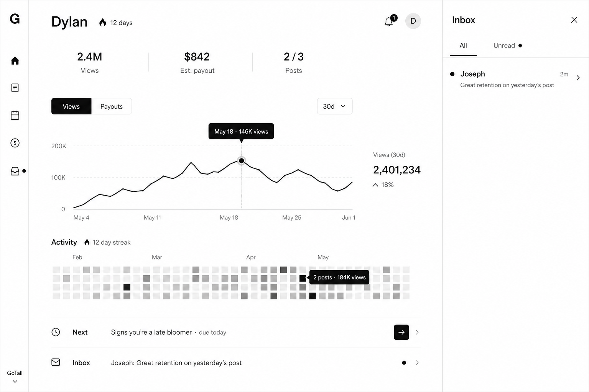
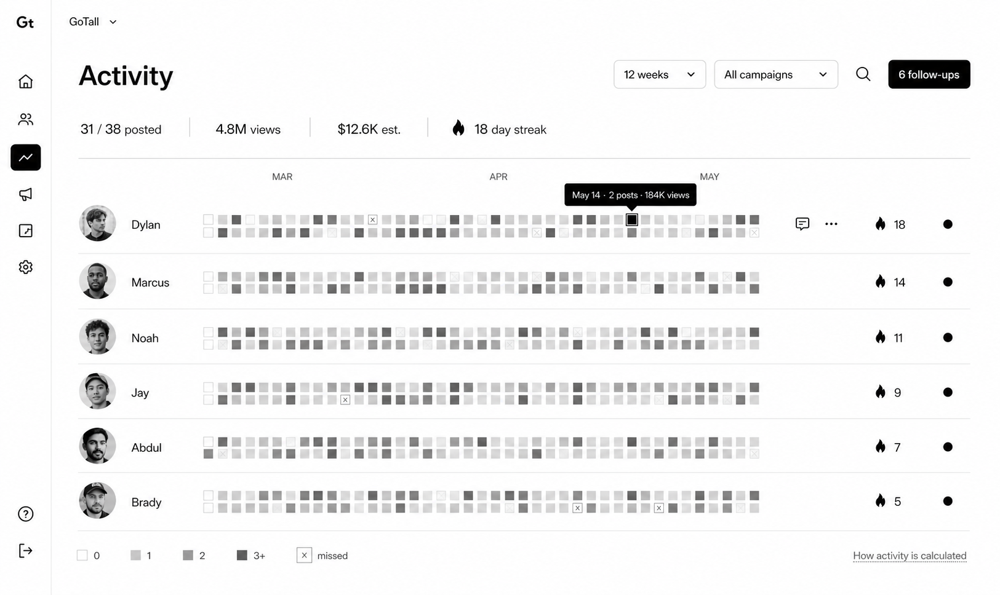
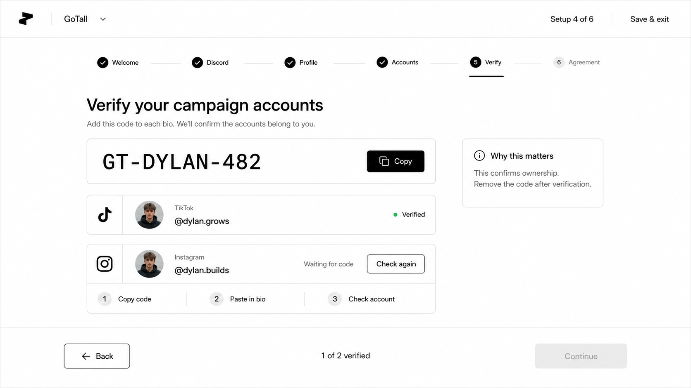

# Creator platform UI ideas

Status: selected concept direction, not production UI.

These renders define the preferred direction for the new creator-first platform:

- neutral, multi-brand product shell;
- primarily white, black, and gray;
- GoTall appears as a workspace or campaign, not as the platform design system;
- relevant creator content: Gen Z male, face-to-camera videos about height, puberty, height prediction, growth tracking, and better habits;
- concise default views with secondary information revealed on hover, expansion, tabs, or drawers.

## Selected concepts

### Creator index

The index prioritizes views, estimated payout, weekly posting progress, streak, and a single primary chart. Views and payouts share the same chart surface through tabs. Instructions collapse into a `Next` row, while messages open in a drawer.

### Admin activity

Daily posting uses a GitHub-style contribution grid. Cell intensity represents post count. Hover reveals the date, posts, views, and other evidence. Creator actions appear only on row hover. Follow-ups open separately rather than occupying permanent screen space.

### Account verification

Onboarding uses one clear task per screen, explicit TikTok and Instagram states, and evidence-based completion. The shell remains monochrome and brand-neutral.

## Interaction rules

- Hovering a chart point reveals the exact date and value.
- Hovering an activity cell reveals posts, views, earnings, and tracking freshness.
- Clicking an activity cell opens that day's posts.
- Clicking `Next` opens the assigned brief.
- Inbox opens as a right-side drawer.
- Admin row actions appear on hover or keyboard focus.
- Explanations live behind an info tooltip or `How this is calculated` link.
- Estimated, approved, and paid earnings are separate tab states.
- Unknown or stale tracking data is never rendered as zero.

## Streak rules

- Completing every required post for a due day extends the streak.
- Scheduled off-days do not break it.
- Approved pauses freeze it.
- Unresolved tracking neither extends nor breaks it.
- A confirmed miss after the grace period resets it.
- Multiple posts increase heatmap intensity but advance the streak by one day.

## Avoid

- heavy GoTall green branding;
- generic wellness or fitness imagery;
- verbose cards and permanently visible instructions;
- separate dashboard tiles for every number;
- conventional large calendar cells for posting activity;
- decorative gradients, glass effects, or gamification color.

The PNGs were generated with the built-in image model and are visual references only. Production components should use real typography, accessible focus states, responsive layouts, and source-backed data states.
